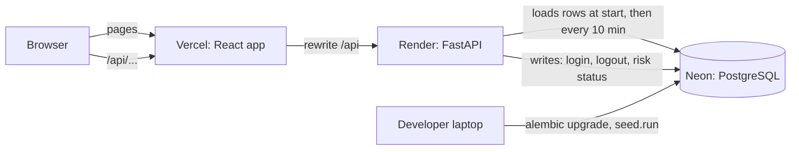

# Architecture

## The picture

The browser only ever talks to one address. Locally that is Vite's dev server, in Docker it is nginx, and on the live site it is Vercel. Each of them passes `/api/...` to the backend. This keeps the login cookie on one site, so there are no cross-site cookie or CORS problems.

## The three signed-in areas

| Area | Address | Who | Backend routes |
|---|---|---|---|
| Admin console | `/console/...` | role `admin` | everything under `/api` except `/api/portal` |
| Employee portal | `/employee/...` | role `employee` | `/api/portal/employee/...`, `/api/portal/entity/...` |
| Customer portal | `/my/...` | role `customer` | `/api/portal/customer/...`, `/api/portal/entity/...` |

There is one login page. The server returns the person's role and home address, and the app goes there.

## What happens on one hover

1. The admin hovers "Karthik Reddy".
2. The browser asks `/api/customers/{id}?view=quick`.
3. FastAPI checks the login cookie and that the person is an admin.
4. A function in `services/entities.py` reads Karthik's rows from memory and works out % paid, overdue amount and health.
5. A small reply comes back and the hover card shows it. Clicking asks for the full view and opens the drawer.

## Backend layout (`backend/app/`)

| Folder | What lives there |
|---|---|
| `core/` | Settings from `.env`, logging, password hashing |
| `db/` | Database session and the 31 table models |
| `api/` | Thin routes: `auth`, `console` (admin), `portal`, `public`, `health` |
| `services/` | All calculations. `snapshot` (rows in memory), `metrics` (KPIs with Explain), `pages`, `entities`, `tables`, `portal` |
| `scoring/` | Buyer health, lead score, project health, employee scorecard. Weights come from `config/scoring.yaml` |
| `risks/` | The rule engine. Rules come from `config/risk_rules.yaml` |
| `../seed/` | The story-driven demo data generator |
| `../tests/` | 96 tests: formulas, stories, API, cross-links, portal safety |

### Why the data is held in memory
The data is small (about 43,000 rows) and almost entirely read-only. The backend loads it once and answers from memory, which makes hover cards instant and means the same Python runs against the SQLite test database and against Postgres. For a much larger database, the functions in `services/` would become SQL queries; what goes in and what comes out would stay the same.

### How each person is kept to their own records
- Console routes require the `admin` role.
- Portal routes take no person id. The server uses the signed-in user's linked employee or customer.
- `services/portal.py` builds the exact list of records a person may open (`scope`), refuses anything else with 403, and removes links to other records from every reply (`scrub`).
- A buyer never receives the admin's customer view, which holds health scores and risk notes.
- `tests/test_portal.py` tries to break these rules.

## Frontend layout (`frontend/src/`)

| Folder | What lives there |
|---|---|
| `app/` | Router, login guard, console layout, portal layout, Ctrl+K search |
| `pages/` | Landing, login, the eight console pages |
| `components/data/` | `KpiCard`, `ChartCard`, `DataTable`, `RiskCard`, formatting components |
| `components/views/` | `EntityLink` (hover and click), `QuickView`, `EntityDrawer`, `ExplainDrawer`, `Blocks` |
| `components/inventory/` | The unit grid |
| `components/landing/` | Landing page sections |
| `lib/` | API client, Indian formatters, URL state, types |

The backend describes tables, hover cards and drawers (columns, facts, tabs, blocks). The frontend has one generic table, one hover card and one drawer that draw whatever arrives. That is why every page looks and behaves the same, and why the portals could reuse the console's parts.

State that should survive a refresh lives in the URL: the date range and project (`?range=30d&project=...`), pinned drawers (`?view=customer:ID,unit:ID`) and the Explain drawer (`?explain=metric`). The browser Back button therefore closes a drawer.

## Ready for the V2 AI copilot
Every calculation is a plain, tested Python function (for example the delay impact, or a customer's full view). In V2 those same functions become the tools an AI model may call, so it can only ever report numbers the system itself calculated. The design is in `docs/ROADMAP_V2.md`.

## Running it

| Where | Frontend | Backend | Database |
|---|---|---|---|
| Laptop | Vite dev server, port 5173 | uvicorn, port 8000 | Neon |
| Docker | nginx, port 8080 | uvicorn in a container | Postgres 16 in a container |
| Live | Vercel | Render | Neon |

CI (`.github/workflows/ci.yml`) runs the backend tests, the frontend tests and build, then starts the whole Docker setup and checks that the API is healthy, the demo admin can sign in, and the landing page is served.
